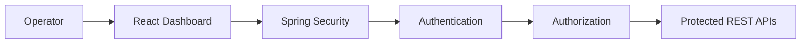
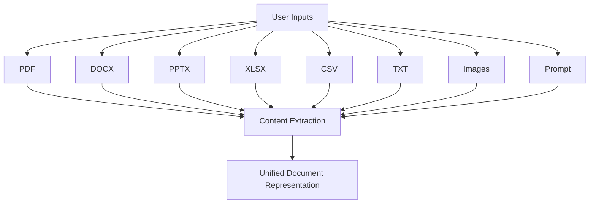
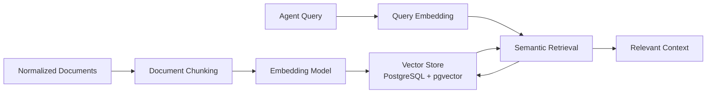
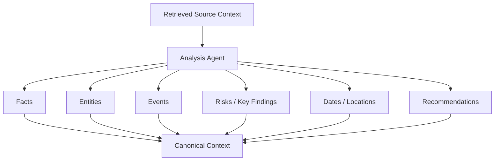
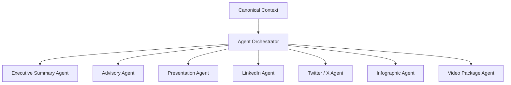
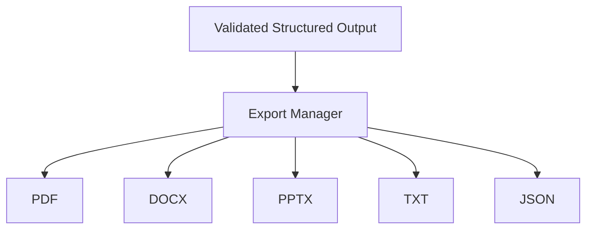
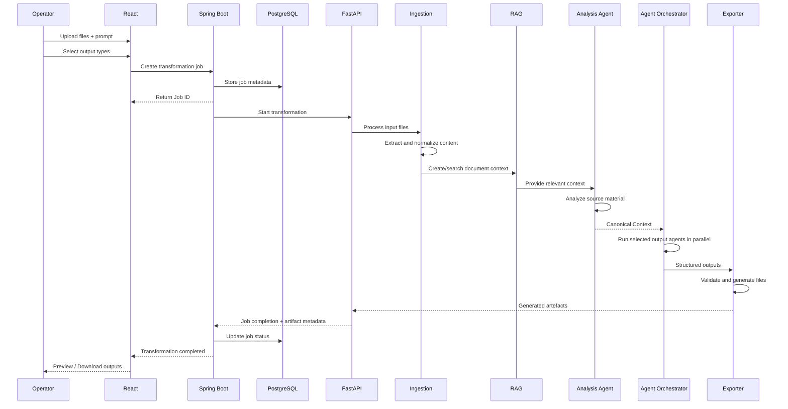
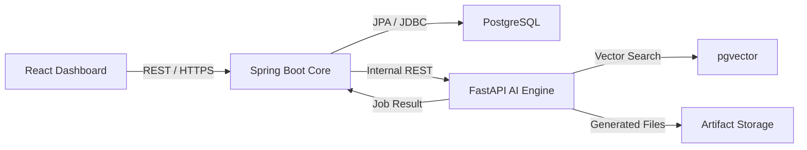
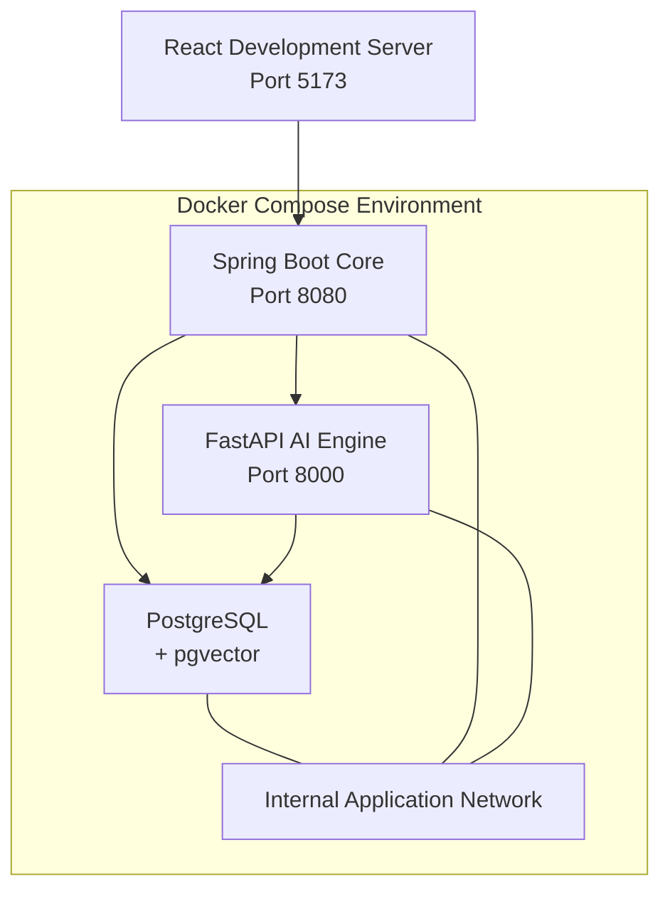

# System Architecture

The **Gen AI Platform for Automated Content Transformation** follows a distributed microservices architecture with a clear separation between the **Enterprise Control Plane** and the **AI Processing Plane**.

The platform accepts multiple input formats and operator instructions, performs document processing and RAG-based contextual analysis, and uses specialized AI agents to generate multiple output artefacts in operator-selected formats.

## High-Level Architecture
### New Architecture including blockchain and cybersecurity
# Gen AI Platform for Automated Content Transformation

A secure, RAG-powered Generative AI platform that transforms heterogeneous
documents and contextual inputs into multiple communication artefacts such as
Executive Summaries, Advisories, Presentations, Social Media Posts, Infographics
and Video Packages.

The platform is designed for enterprise and cybersecurity-oriented environments
where data isolation, provenance, auditability and output integrity are critical.

---

# System Architecture

The platform follows a microservices-oriented architecture divided into:

1. User Experience Plane
2. Enterprise Control Plane
3. AI Processing Plane
4. Trust & Security Layer
5. Data & Artifact Layer

---

## High-Level Architecture

```mermaid
flowchart TB

    USER["Operator / User"]

    subgraph UX["USER EXPERIENCE PLANE"]
        REACT["React Web Dashboard"]
        UPLOAD["Multi-File Upload"]
        PROMPT["Prompt & Context Input"]
        CONFIG["Output & Generation Controls"]
        PREVIEW["Preview / Download"]
        VERIFY["Artifact Verification"]
    end

    subgraph CONTROL["ENTERPRISE CONTROL PLANE"]
        SB["Spring Boot Backend"]
        SEC["Spring Security"]
        AUTH["JWT Authentication"]
        RBAC["Role Based Access Control"]
        JOB["Job Management"]
        AUDIT["Audit Logging"]
        API["Internal API"]
    end

    subgraph DATA["DATA & STORAGE"]
        PG["PostgreSQL"]
        VECTOR["pgvector"]
        OBJECT["Artifact Storage"]
    end

    subgraph AI["AI PROCESSING PLANE"]
        FASTAPI["FastAPI AI Engine"]
        ORCH["Transformation Orchestrator"]

        INGEST["Multi-Format Ingestion"]
        EXTRACT["Content Extraction"]
        NORMALIZE["Content Normalization"]
        CHUNK["Document Chunking"]

        EMBED["Embedding Model"]
        RETRIEVE["Semantic Retriever"]
        RAG["RAG Pipeline"]

        ANALYSIS["Analysis Agent"]
        CONTEXT["Canonical Context"]

        OUT_ORCH["Output Agent Orchestrator"]

        SUMMARY["Executive Summary Agent"]
        ADVISORY["Advisory Agent"]
        SOCIAL["Social Media Agent"]
        PRESENT["Presentation Agent"]
        INFO["Infographic Agent"]
        VIDEO["Video Package Agent"]

        VALIDATE["Structured Output Validation"]
        EXPORT["Format Exporters"]
    end

    subgraph TRUST["TRUST & SECURITY LAYER"]
        HASH["SHA-256 Integrity Hashing"]
        BLOCKCHAIN["Permissioned Blockchain"]
        PROVENANCE["Provenance Records"]
    end

    USER --> REACT

    REACT --> UPLOAD
    REACT --> PROMPT
    REACT --> CONFIG
    REACT --> PREVIEW
    REACT --> VERIFY

    UPLOAD --> SB
    PROMPT --> SB
    CONFIG --> SB

    SB --> SEC
    SEC --> AUTH
    SEC --> RBAC
    SB --> JOB
    SB --> AUDIT
    SB --> API

    SB --> FASTAPI

    FASTAPI --> ORCH

    ORCH --> INGEST
    INGEST --> EXTRACT
    EXTRACT --> NORMALIZE
    NORMALIZE --> CHUNK

    CHUNK --> EMBED
    EMBED --> VECTOR
    VECTOR --> RETRIEVE
    RETRIEVE --> RAG

    RAG --> ANALYSIS
    ANALYSIS --> CONTEXT

    CONTEXT --> OUT_ORCH

    OUT_ORCH --> SUMMARY
    OUT_ORCH --> ADVISORY
    OUT_ORCH --> SOCIAL
    OUT_ORCH --> PRESENT
    OUT_ORCH --> INFO
    OUT_ORCH --> VIDEO

    SUMMARY --> VALIDATE
    ADVISORY --> VALIDATE
    SOCIAL --> VALIDATE
    PRESENT --> VALIDATE
    INFO --> VALIDATE
    VIDEO --> VALIDATE

    VALIDATE --> EXPORT
    EXPORT --> OBJECT

    PG --> JOB
    PG --> AUDIT
    VECTOR --> PG

    OBJECT --> HASH
    HASH --> BLOCKCHAIN
    BLOCKCHAIN --> PROVENANCE

    HASH --> VERIFY
    PROVENANCE --> VERIFY

```mermaid
flowchart TB

    USER["Operator / User"]

    subgraph FRONTEND["Presentation Layer"]
        REACT["React Dashboard<br/>Vite + Tailwind CSS"]
    end

    subgraph ENTERPRISE["Enterprise Control Plane"]
        SECURITY["Spring Security<br/>Authentication & Authorization"]
        API["Spring Boot Core<br/>REST APIs"]
        JOB["Transformation Job Service"]
        DB["PostgreSQL<br/>Users / Jobs / Metadata / Audit"]
    end

    subgraph AI["AI Processing Plane"]
        FASTAPI["FastAPI AI Engine"]

        ORCH["Request Orchestrator"]

        INGEST["Multi-Format Input Ingestion"]

        NORMALIZE["Content Normalization<br/>Cleaning / Metadata / Chunking"]

        RAG["RAG Pipeline"]

        EMBED["Embedding Model"]

        VECTOR["Vector Store<br/>PostgreSQL + pgvector"]

        RETRIEVER["Semantic Retriever"]

        ANALYSIS["Analysis Agent"]

        CONTEXT["Canonical Context"]

        AGENTS["Agent Orchestrator"]

        SUMMARY["Executive Summary Agent"]
        ADVISORY["Advisory Agent"]
        PRESENTATION["Presentation Agent"]
        SOCIAL["Social Media Agent"]
        INFOGRAPHIC["Infographic Agent"]
        VIDEO["Video Package Agent"]

        VALIDATE["Output Validation<br/>Pydantic Schemas"]

        EXPORT["Output Generation / Exporters"]

        PDF["PDF Generator"]
        DOCX["DOCX Generator"]
        PPTX["PPTX Generator"]
        TEXT["TXT / JSON Generator"]
    end

    subgraph STORAGE["Artifact Storage"]
        FILES["Generated Artefacts<br/>Files + Metadata"]
    end

    USER --> REACT

    REACT -->|"HTTPS / REST"| SECURITY
    SECURITY --> API

    API --> JOB
    JOB --> DB

    JOB -->|"AI Transformation Request"| FASTAPI

    FASTAPI --> ORCH
    ORCH --> INGEST

    INGEST --> NORMALIZE
    NORMALIZE --> RAG

    RAG --> EMBED
    EMBED --> VECTOR
    RAG --> RETRIEVER
    RETRIEVER --> VECTOR

    RETRIEVER --> ANALYSIS
    ANALYSIS --> CONTEXT

    CONTEXT --> AGENTS

    AGENTS --> SUMMARY
    AGENTS --> ADVISORY
    AGENTS --> PRESENTATION
    AGENTS --> SOCIAL
    AGENTS --> INFOGRAPHIC
    AGENTS --> VIDEO

    SUMMARY --> VALIDATE
    ADVISORY --> VALIDATE
    PRESENTATION --> VALIDATE
    SOCIAL --> VALIDATE
    INFOGRAPHIC --> VALIDATE
    VIDEO --> VALIDATE

    VALIDATE --> EXPORT

    EXPORT --> PDF
    EXPORT --> DOCX
    EXPORT --> PPTX
    EXPORT --> TEXT

    PDF --> FILES
    DOCX --> FILES
    PPTX --> FILES
    TEXT --> FILES

    FILES --> JOB
    JOB --> API
    API --> REACT

```

---

# Architecture Overview

The system is divided into the following major layers:

1. **Presentation Layer**
2. **Enterprise Control Plane**
3. **AI Processing Plane**
4. **RAG and Knowledge Layer**
5. **Agent Orchestration Layer**
6. **Output Generation Layer**
7. **Persistence and Artifact Storage**

---

## 1. Presentation Layer

The frontend is implemented using:

- React.js
- Vite
- Tailwind CSS

The dashboard allows an operator to:

- Upload multiple files
- Enter free-form prompts
- Provide additional contextual information
- Select one or more output types
- Select target language
- Select target audience
- Select tone
- Select level of detail
- Monitor transformation progress
- Preview generated outputs
- Download generated artefacts

### Example Request

```json
{
  "prompt": "Prepare a formal executive briefing about the incident.",
  "outputs": [
    "EXECUTIVE_SUMMARY",
    "ADVISORY",
    "PRESENTATION"
  ],
  "parameters": {
    "language": "English",
    "tone": "Formal",
    "audience": "Senior Officials",
    "detail_level": "High"
  }
}
```

---

# 2. Enterprise Control Plane

The Enterprise Control Plane is implemented using:

- Java 17+
- Spring Boot 3.x
- Spring Security
- Spring Data JPA
- PostgreSQL

Its primary responsibility is to manage the application's business and security operations.

### Responsibilities

- Authentication
- Authorization
- User management
- Role management
- Transformation job creation
- Job status tracking
- Request validation
- Input/output metadata
- Communication with the AI engine
- Audit logging
- Artifact metadata management

The Spring Boot service acts as the **control plane**, while FastAPI acts as the **AI execution plane**.

---

# 3. Authentication and Authorization

Spring Security provides the security boundary for the application.



Possible roles include:

```text
ADMIN
OPERATOR
ANALYST
VIEWER
```

The initial prototype keeps the Spring Security configuration intentionally simple while maintaining a structure that can be extended later.

---

# 4. Transformation Job Management

Every transformation request is represented as a job.

```text
CREATED
   |
   v
UPLOADING
   |
   v
PROCESSING
   |
   v
ANALYZING
   |
   v
GENERATING
   |
   v
EXPORTING
   |
   v
COMPLETED
```

If an error occurs:

```text
PROCESSING
     |
     v
   FAILED
```

A job contains:

- Job ID
- User ID
- Prompt
- Input file metadata
- Selected outputs
- Generation parameters
- Current status
- Creation timestamp
- Completion timestamp
- Generated artifact references

---

# 5. AI Processing Plane

The AI Engine is implemented using:

- Python 3.11+
- FastAPI
- Pydantic
- LangChain
- AsyncIO

FastAPI is responsible for the actual AI processing pipeline.

```mermaid
flowchart LR

    REQUEST["Transformation Request"]

    API["FastAPI"]

    ORCH["Request Orchestrator"]

    INGEST["Input Ingestion"]

    NORMALIZE["Normalization"]

    RAG["RAG"]

    ANALYSIS["Analysis Agent"]

    AGENTS["Output Agents"]

    EXPORT["Exporters"]

    RESPONSE["Generated Artefacts"]

    REQUEST --> API
    API --> ORCH
    ORCH --> INGEST
    INGEST --> NORMALIZE
    NORMALIZE --> RAG
    RAG --> ANALYSIS
    ANALYSIS --> AGENTS
    AGENTS --> EXPORT
    EXPORT --> RESPONSE

```



---

# 6. Multi-Format Input Ingestion

The platform is designed to accept heterogeneous input sources.

### Supported / Planned Inputs

```text
PDF
DOCX
PPTX
XLSX
CSV
TXT
Plain Text
Images
Operator Prompt
Contextual Information
```

The ingestion layer identifies the input type and uses an appropriate parser.



---

# 7. Content Normalization

Different file formats are converted into a common internal representation.

The normalization pipeline performs:

```text
Extraction
    |
    v
Cleaning
    |
    v
Metadata Extraction
    |
    v
Deduplication
    |
    v
Language Detection
    |
    v
Chunking
    |
    v
Unified Document Representation
```

Conceptually:

```json
{
  "document_id": "doc-001",
  "source_type": "PDF",
  "title": "Incident Report",
  "metadata": {},
  "content": "...",
  "chunks": [
    {
      "chunk_id": "chunk-001",
      "text": "...",
      "metadata": {}
    }
  ]
}
```

---

# 8. RAG Pipeline

The platform uses Retrieval-Augmented Generation to provide relevant source context to the AI agents.



### Important

The initial implementation does **not require TF-IDF**.

The primary retrieval mechanism is:

```text
Documents
   ↓
Chunks
   ↓
Embeddings
   ↓
Vector Store
   ↓
Semantic Retrieval
```

A hybrid BM25/keyword retrieval system can be added later if required.

---

# 9. Analysis Agent

The Analysis Agent is the central reasoning stage.

Instead of allowing every output agent to independently process the source documents, the system first creates a shared contextual representation.



The **Canonical Context** becomes the common source of truth for the downstream agents.

---

# 10. Agent Orchestration

The system uses specialized agents for different communication artefacts.



Only the agents selected by the operator need to execute.

For example:

```text
Selected Outputs:

Executive Summary
Advisory
Presentation
```

The orchestrator can execute:

```text
                 Canonical Context
                        |
                 Agent Orchestrator
                        |
             +----------+----------+
             |          |          |
             v          v          v
          Summary    Advisory   Presentation
           Agent       Agent       Agent
```

Independent agents can execute concurrently using asynchronous execution where appropriate.

---

# 11. Structured AI Outputs

The agents should not directly generate final binary files.

Instead:

```text
LLM
 |
 v
Structured Pydantic Model
 |
 v
Validation
 |
 v
Exporter
 |
 v
Final File
```

For example:

## TwitterThread

```python
class TwitterThread(BaseModel):
    tweets: list[str]
```

## PresentationOutput

```python
class PresentationOutput(BaseModel):
    title: str
    slides: list[Slide]
```

This provides predictable interfaces between the AI generation and file-generation layers.

---

# 12. Output Validation

Generated content passes through a validation layer before export.

Validation can include:

- Pydantic schema validation
- Required fields
- Output structure
- Length constraints
- Source grounding
- Content consistency
- Output-specific rules

Example:

```text
Agent Output
     |
     v
Pydantic Validation
     |
     +---- Invalid ----> Regeneration / Error
     |
     v
Valid Structured Output
     |
     v
Exporter
```

---

# 13. Output Generation

The exporter converts structured AI output into the requested file format.



The important separation is:

> **LLM generates structured content; deterministic application code generates the actual file.**

For example:

```text
Presentation Agent
       |
       v
PresentationOutput
       |
       v
PPTX Generator
       |
       v
presentation.pptx
```

---

# 14. End-to-End Transformation Flow

The complete request lifecycle is:



---

# 15. Microservices Structure

The recommended repository structure is:

```text
gen-ai-content-transformation/
│
├── README.md
├── docker-compose.yml
├── .env.example
├── .gitignore
│
├── frontend/
│   └── react-dashboard/
│       ├── src/
│       │   ├── components/
│       │   ├── pages/
│       │   ├── services/
│       │   ├── hooks/
│       │   └── App.jsx
│       ├── package.json
│       └── vite.config.js
│
├── backend/
│   └── spring-boot-core/
│       ├── src/
│       │   ├── main/
│       │   │   ├── java/
│       │   │   └── resources/
│       │   └── test/
│       ├── pom.xml
│       └── Dockerfile
│
├── ai-engine/
│   └── fastapi-engine/
│       ├── app/
│       │   ├── api/
│       │   ├── agents/
│       │   ├── ingestion/
│       │   ├── rag/
│       │   ├── models/
│       │   ├── exporters/
│       │   └── main.py
│       ├── requirements.txt
│       └── Dockerfile
│
├── docs/
│   ├── architecture.md
│   └── api-specification.md
│
└── storage/
    └── generated/
```

---

# 16. Service Communication



---

# 17. Docker Compose Architecture

For local development, all backend services can run inside a shared Docker network.



Example services:

```yaml
services:

  postgres:
    image: pgvector/pgvector:pg16
    ports:
      - "5432:5432"

  spring-boot-core:
    build: ./backend/spring-boot-core
    ports:
      - "8080:8080"
    depends_on:
      - postgres
      - fastapi-engine

  fastapi-engine:
    build: ./ai-engine/fastapi-engine
    ports:
      - "8000:8000"
    depends_on:
      - postgres
```

---

# 18. Data Flow Summary

The complete transformation pipeline can be summarized as:

```text
┌─────────────────────┐
│ Multiple Inputs     │
│ PDF DOCX PPTX XLSX │
│ CSV TXT Images     │
│ + Operator Prompt  │
└──────────┬──────────┘
           │
           v
┌─────────────────────┐
│ Content Extraction  │
└──────────┬──────────┘
           │
           v
┌─────────────────────┐
│ Normalization       │
│ + Chunking          │
└──────────┬──────────┘
           │
           v
┌─────────────────────┐
│ RAG / Retrieval     │
│ Embeddings + Vector │
│ Search              │
└──────────┬──────────┘
           │
           v
┌─────────────────────┐
│ Analysis Agent      │
└──────────┬──────────┘
           │
           v
┌─────────────────────┐
│ Canonical Context   │
└──────────┬──────────┘
           │
           v
┌─────────────────────┐
│ Agent Orchestrator  │
└──────────┬──────────┘
           │
      ┌────┼────┬────────┐
      v    v    v        v
   Summary Advisory PPT Social
      │    │    │        │
      └────┼────┼────────┘
           │
           v
┌─────────────────────┐
│ Pydantic Validation │
└──────────┬──────────┘
           │
           v
┌─────────────────────┐
│ Output Exporters    │
└──────────┬──────────┘
           │
      ┌────┼────┬─────┐
      v    v    v     v
     PDF DOCX PPTX  TXT
```

---

# 19. Key Design Principles

### 1. Separation of concerns

```text
React
  → User Interface

Spring Boot
  → Enterprise Control Plane

FastAPI
  → AI Processing Plane

PostgreSQL
  → Persistent Metadata + Vector Data

Exporters
  → Deterministic File Generation
```

### 2. One source analysis, multiple outputs

Instead of independently processing every requested output:

```text
Documents
    ↓
RAG
    ↓
Analysis
    ↓
Canonical Context
    ↓
Multiple Agents
```

This improves consistency between generated artefacts.

### 3. Parallel generation

Independent output agents can execute concurrently:

```text
                    Canonical Context
                           |
                     Orchestrator
                           |
             +-------------+-------------+
             |             |             |
             v             v             v
          Summary       Advisory      PPT Agent
           Agent          Agent         Agent
```

### 4. Structured generation

```text
LLM
 ↓
Pydantic
 ↓
Validation
 ↓
Exporter
```

This reduces malformed outputs and makes file generation reliable.

### 5. Extensibility

New output types can be added without redesigning the entire system.

For example:

```text
Existing:

Summary Agent
Advisory Agent
Presentation Agent

       +

New:

Threat Brief Agent
Email Agent
Press Release Agent
Video Script Agent
```

---

# 20. Final Architecture Concept

The core innovation of the platform is:

```text
         HETEROGENEOUS INPUTS
                  │
                  ▼
        ┌─────────────────────┐
        │  Unified Processing │
        └──────────┬──────────┘
                   │
                   ▼
              RAG + LLM
                   │
                   ▼
         ┌─────────────────────┐
         │  CANONICAL CONTEXT  │
         └──────────┬──────────┘
                    │
                    ▼
          ┌───────────────────┐
          │ AGENT ORCHESTRATOR│
          └─────────┬─────────┘
                    │
       ┌────────────┼─────────────┐
       ▼            ▼             ▼
    SUMMARY      ADVISORY    PRESENTATION
       │            │             │
       └────────────┼─────────────┘
                    ▼
           STRUCTURED OUTPUT
                    │
                    ▼
              FILE EXPORT
                    │
       ┌────────────┼─────────────┐
       ▼            ▼             ▼
      PDF          DOCX          PPTX
```

> **Core Value Proposition:**  
> **One source of information → intelligent contextual understanding → multiple specialized AI transformations → multiple validated communication artefacts.**
